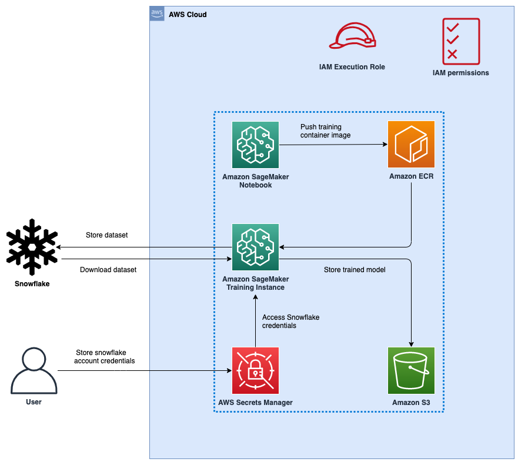

# Snowflake as data source for training an ML Model with Amazon SageMaker

This repository provides an example of how to use the [Snowflake Data Cloud](https://www.snowflake.com/) as a source of training data for training a machine learning (ML) model in Amazon SageMaker. We download the training data from a Snowflake table directly into a Amazon SageMaker training instance rather than into an Amazon S3 bucket.

We use the [California Housing Dataset](https://inria.github.io/scikit-learn-mooc/python_scripts/datasets_california_housing.html) in this example to to train a regression model to predict the median house value for each district. We create a custom container for running the training job, this container uses the [SageMaker XGBoost container image](https://github.com/aws/sagemaker-xgboost-container) as the base image and includes the [snowflake-python connector](https://pypi.org/project/snowflake-connector-python/) for interfacing with Snowflake.

The following figure represents the high-level architecture of the proposed solution to use Snowflake as a data source to train ML models with Amazon SageMaker.

***New:*** For users that prefer a low-code or out of the box solution, [Amazon SageMaker JumpStart](https://docs.aws.amazon.com/sagemaker/latest/dg/studio-jumpstart.html) now offers XGBoost and SKLearn models with direct data integration to Snowflake. The [notebook sagemaker-snowflake-example-jumpstart.ipynb](./sagemaker-snowflake-example-jumpstart.ipynb) shows how to use JumpStart's XGBoost model to train a regressor model directly on data in Snowflake without needing to copy the data to S3 and without needing to write a custom training script.

## Installation

Follow the steps listed below prior to running the notebooks included in this repository.

1. Create a free account with Snowflake. Detailed instructions are available in [`snowflake-instructions`](./snowflake-instructions.md) file.

1. Launch the cloud formation template included in this repository using one of the buttons from the table below. The cloud formation template will create an IAM role called `SageMakerSnowFlakeExample` and a SageMaker Notebook called `aws-aiml-blogpost-sagemaker-snowflake-example` that we will use for running the code in this repository.

   |AWS Region                |     Link        |
   |:------------------------:|:-----------:|
   |us-east-1 (N. Virginia)    |  |
   |us-east-2 (Ohio)          |  |
   |us-west-1 (N. California) |  |
   |eu-west-1 (Dublin)        |  |
   |ap-northeast-1 (Tokyo)    |  |

## Usage

Follow step-by-step instructions provided in [the blog post](blog_post.md).

## Contributing

Pull requests are welcome. For major changes, please open an issue first to discuss what you would like to change. See [CONTRIBUTING](./CONTRIBUTING.md)

## Roadmap

See the open issues for a full list of proposed features (and known issues).

## Security

See [CONTRIBUTING](CONTRIBUTING.md#security-issue-notifications) for more information.

## License

This library is licensed under the MIT-0 License. See the LICENSE file.