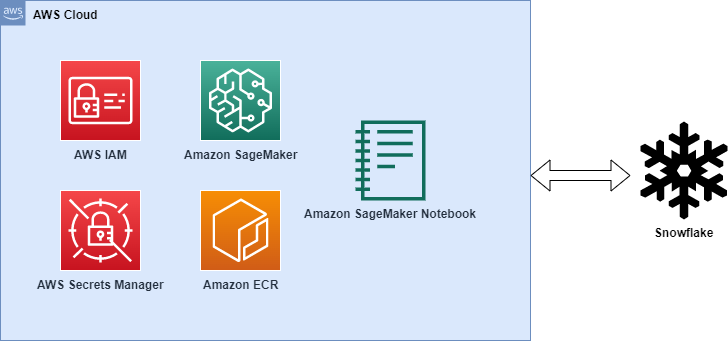
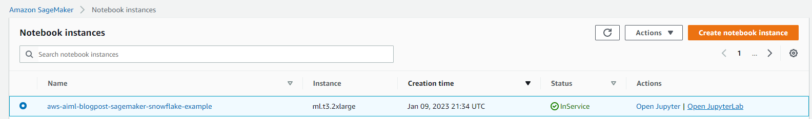
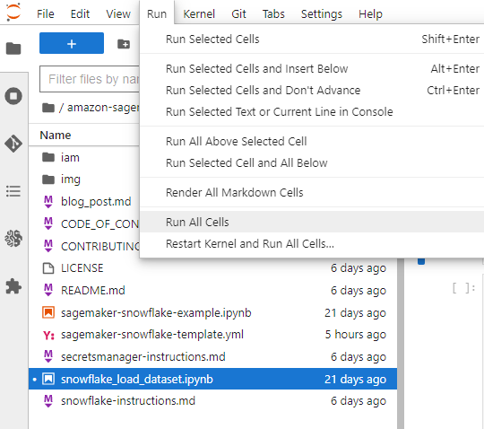

# Using Snowflake as a data source to train ML models with Amazon SageMaker

_Amit Arora_, _Divya Muralidharan_

Amazon SageMaker requires that the training data for a machine learning model be present either in [S3 or in EFS or in FSX for Lustre](https://aws.amazon.com/blogs/machine-learning/choose-the-best-data-source-for-your-amazon-sagemaker-training-job/). In order to train a model using data stored outside of the three supported storage services, the data first needs to be ingested into one of these services (typically S3). This requires building a data pipeline (using tools such as [Amazon SageMaker Data Wrangler](https://aws.amazon.com/sagemaker/data-wrangler/)) to move data into S3. However, this may create a data management challenge in terms of managing the lifecycle of this data, access controls and more. In such situations it may be desirable to have the data accessible to SageMaker _without_ the intermediate storage of data in S3.

This post shows a way to do this using [Snowflake](https://www.snowflake.com/) as the data source and by downloading the data directly from Snowflake into a SageMaker Training Job instance.

## Solution overview

We use the [California Housing Dataset](https://inria.github.io/scikit-learn-mooc/python_scripts/datasets_california_housing.html) as a training dataset for this post and train an ML model to predict the median house value for each district. We add this data to Snowflake as a new table. We create a custom training container which downloads data directly from the Snowflake table into the training instance **_rather than first downloading the data into an S3 bucket_**. Once the data is downloaded into the training instance, the custom training script performs data preparation tasks and then trains the machine learning model using the [XGBoost Estimator](https://sagemaker.readthedocs.io/en/stable/frameworks/xgboost/using_xgboost.html). All code for this blog post is available in this [GitHub repo](https://github.com/aws-samples/amazon-sagemaker-w-snowflake-as-datasource).


## Walkthrough

The following figure represents the high-level architecture of the proposed solution to use Snowflake as a data source to train ML models with Amazon SageMaker



The workflow for the above architecture is as follows. The detailed instructions for each step are provided later in this post.

1. Ingest the data in a table in your Snowflake account.

1. Store your Snowflake account credentials in AWS Secrets Manager.

1. Setup an IAM role with appropriate permissions to allow Amazon SageMaker to access Amazon ECR, AWS Secrets Manager and other services within your AWS account.

1. Create a custom container image for ML model training and push it to Amazon ECR.

1. Launch a SageMaker Training job for training the ML model. The training instance retrieves Snowflake credentials from AWS Secrets Manager and then uses these credentials to download the dataset from Snowflake directly. _This is the step that eliminates the need for data to be downloaded first into an S3 bucket_.

1. The trained ML model is stored in an S3 bucket.

### Prerequisites

To implement the solution provided in this post, you should have an [AWS account](https://signin.aws.amazon.com/signin?redirect_uri=https%3A%2F%2Fportal.aws.amazon.com%2Fbilling%2Fsignup%2Fresume&client_id=signup), a [Snowflake account](https://signup.snowflake.com/?utm_cta=trial-en-www-homepage-top-right-nav-ss-evg&_ga=2.36125795.2140702267.1672969035-1338836953.1670007010) and familiarity with Amazon SageMaker.

### Deployment steps

The following section provide a detailed description of the steps listed in the walkthrough section.

#### Set up IAM role and SageMaker Notebook

1. Click 'Launch Stack' for the AWS region you want to deploy resources into. This cloud formation template will create an IAM role called `SageMakerSnowFlakeExample` and a SageMaker Notebook called `aws-aiml-blogpost-sagemaker-snowflake-example` in your AWS account.

   |AWS Region                |     Link        |
   |:------------------------:|:-----------:|
   |us-east-1 (N. Virgnia)    | [](https://console.aws.amazon.com/cloudformation/home?region=us-east-1#/stacks/new?stackName=sm-fs-streaming-agg-stack&templateURL=https://aws-blogs-artifacts-public.s3.amazonaws.com/artifacts/ML-12893/sagemaker-snowflake-template.yml) |
   |us-east-2 (Ohio)          | [](https://console.aws.amazon.com/cloudformation/home?region=us-east-2#/stacks/new?stackName=sm-fs-streaming-agg-stack&templateURL=https://aws-blogs-artifacts-public.s3.amazonaws.com/artifacts/ML-12893/sagemaker-snowflake-template.yml) |
   |us-west-1 (N. California) | [](https://console.aws.amazon.com/cloudformation/home?region=us-west-1#/stacks/new?stackName=sm-fs-streaming-agg-stack&templateURL=https://aws-blogs-artifacts-public.s3.amazonaws.com/artifacts/ML-12893/sagemaker-snowflake-template.yml) |
   |eu-west-1 (Dublin)        | [](https://console.aws.amazon.com/cloudformation/home?region=eu-west-1#/stacks/new?stackName=sm-fs-streaming-agg-stack&templateURL=https://aws-blogs-artifacts-public.s3.amazonaws.com/artifacts/ML-12893/sagemaker-snowflake-template.yml) |
   |ap-northeast-1 (Tokyo)    | [](https://console.aws.amazon.com/cloudformation/home?region=ap-northeast-1#/stacks/new?stackName=sm-fs-streaming-agg-stack&templateURL=https://aws-blogs-artifacts-public.s3.amazonaws.com/artifacts/ML-12893/sagemaker-snowflake-template.yml) |

#### Store Snowflake credentials in AWS Secrets Manager

To secure the user's Snowflake account credentials for access by Amazon SageMaker, the credentials are stored as secrets in AWS Secrets Manager. The procedure to store secrets in AWS Secrets Manager can be referred from [Create an AWS Secrets Manager secret](https://docs.aws.amazon.com/secretsmanager/latest/userguide/create_secret.html)

#### Ingest the data in a table in your Snowflake account

1. In your AWS console navigate to Amazon SageMaker -> Notebooks and then click on `Open JupyterLab` for `aws-aiml-blogpost-sagemaker-snowflake-example`.

   

1. Click on `snowflake_load_dataset.ipynb` to open it in Jupyter and then click on `Run All Cells`. This will ingest the [California Housing Dataset](https://inria.github.io/scikit-learn-mooc/python_scripts/datasets_california_housing.html) to a Snowflake table.

   

```{python}
import pandas as pd 
import snowflake.connector
from sklearn.datasets import fetch_california_housing
from snowflake.connector.pandas_tools import write_pandas

# connect to Snowflake account
conn = snowflake.connector.connect(
    user        = "your_username",
    password    =  sf_password,
    account     = "your_accountid",
    warehouse   = "warehouse",
    protocol    = "https"
    )

# fetch California Housing dataset
housing_dataset = fetch_california_housing(as_frame = True)

df_X = housing_dataset['data']
df_y = housing_dataset['target']
df_housing = df_X.assign(MedHouseVal = df_y)

# write the data from the DataFrame to the Snowflake table.
write_pandas(
        conn=conn,
        df=df_housing,
        table_name=snowflake_table,
        database=snowflake_db,
        schema=housing_schema
    ) 
```

#### Creation of custom container image

For creating a custom container image, the SageMaker XGBoost container image - `246618743249.dkr.ecr.us-west-2.amazonaws.com/sagemaker-xgboost:1.5-1` is used as the base image for this container.
The following are added to the base image:

- [Snowflake Connector for Python](https://docs.snowflake.com/en/user-guide/python-connector.html).
- A script to download Snowflake account credentials from  AWS Secrets Manager. These credentials are used to connect to Snowflake.

   ```{python}
   # Build an image that can be used for training in Amazon SageMaker, we use
   # the SageMaker XGBoost as the base image as it contains support for distributed
   # training.
   FROM 246618743249.dkr.ecr.us-west-2.amazonaws.com/sagemaker-xgboost:1.5-1

   MAINTAINER Amazon AI <sage-learner@amazon.com>


   RUN apt-get -y update && apt-get install -y --no-install-recommends \
            wget \
            python3-pip \
            python3-setuptools \
            nginx \
            ca-certificates \
      && rm -rf /var/lib/apt/lists/*

   RUN ln -s /usr/bin/python3 /usr/bin/python
   RUN ln -s /usr/bin/pip3 /usr/bin/pip

   # Here we get snowflake-connector python package.
   # pip leaves the install caches populated which uses a 
   # significant amount of space. These optimizations save a fair 
   # amount of space in the image, which reduces start up time.
   RUN pip --no-cache-dir install snowflake-connector-python==2.8.3  

   # Include python script for retrieving Snowflake credentials 
   # from AWS SecretsManager
   ADD snowflake_credentials.py /

   ```

The container image is built and pushed to the container registry i.e. Amazon ECR. This image will be used for downloading data from Snowflake, performing data preparation and finally for training the ML model.

#### Training Amazon SageMaker Job

To train our ML model using SageMaker Training Jobs, the following steps are taken:

1. Creation of separate Python scripts for connecting to Snowflake, querying (downloading) the data using [Snowflake Connector for Python](https://docs.snowflake.com/en/user-guide/python-connector.html), preparing the data for ML and finally a training scripts which ties everything together.

1. Providing the training script to the SageMaker SDK [Estimator](https://sagemaker.readthedocs.io/en/stable/api/training/estimators.html) along with the source directory so that all the scripts we create can be provided to the training container when the training job is run using the [Estimator.fit](https://sagemaker.readthedocs.io/en/stable/api/training/estimators.html#sagemaker.estimator.EstimatorBase.fit) method. You can find detailed guidance in the documentation on [Preparing a Scikit-Learn training script](https://sagemaker.readthedocs.io/en/stable/frameworks/sklearn/using_sklearn.html#prepare-a-scikit-learn-training-script) (for training).

   ```{python}
      # Define training hyperparameters
      train_hp = {
         'max_depth': args.max_depth,
         'eta': args.eta,
         'gamma': args.gamma,
         'min_child_weight': args.min_child_weight,
         'subsample': args.subsample,
         'verbosity': args.verbosity,
         'objective': args.objective,
         'tree_method': args.tree_method,
         'predictor': args.predictor,
      }
      
      xgb_train_args = dict(
         params=train_hp,
         dtrain=dtrain,
         evals=watchlist,
         num_boost_round=args.num_round,
         model_dir=args.model_dir)

      if len(sm_hosts) > 1:
         # Wait until all hosts are able to find each other
         entry_point._wait_hostname_resolution()

         # Execute training function after initializing rabit.
         distributed.rabit_run(
               exec_fun=_xgb_train,
               args=xgb_train_args,
               include_in_training=(dtrain is not None),
               hosts=sm_hosts,
               current_host=sm_current_host,
               update_rabit_args=True
         )
      else:
         # If single node training, call training method directly.
         if dtrain:
               xgb_train_args['is_master'] = True
               _xgb_train(**xgb_train_args)
         else:
               raise ValueError("Training channel must have data to train model.")

   ```

```

# Retrieve XGBoost custom container from ECR registry path 
custom_img_uri = account_id+".dkr.ecr."+region+".amazonaws.com/"+custom_img_name+":"+custom_img_tag
print(f"\nUsing Custom Image URI: {custom_img_uri}")

# Create Sagemaker Estimator
xgb_script_mode_estimator = sagemaker.estimator.Estimator(
    image_uri = custom_img_uri,
    role=role,
    instance_count=instance_count,
    instance_type=instance_type,
    output_path="s3://{}/{}/output".format(bucket, prefix),
    sagemaker_session=session,
    entry_point="train.py",
    source_dir="./src",
    hyperparameters=hyperparams,
    environment=env,
    subnets = subnet_ids,
)

# Estimator fitting
xgb_script_mode_estimator.fit()

```

Please note that the data from Snowflake is downloaded directly into the training container instance and at no point is it stored in S3.

For distributed data parallel training a random subset of data is downloaded into each training instance. Each training instance downloads an equal amount of data which is simply `total number of table records/ total number of training hosts`.


## Cleaning up

To avoid incurring future charges, delete the resources.

## Conclusion

In this solution, we saw how to download data stored in Snowflake table to Sagemaker Training job instance and train a XGBoost model using a custom training container. **This approach allows us to directly integrate Snowflake as a data source with Sagemaker notebook without having the data staged on S3.**

[Optional] Author bio
Photo Three sentences introducing the author’s AWS role, experience and interests, and a lighthearted personal note.
