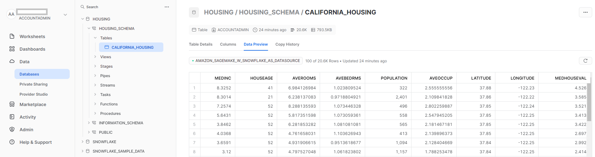
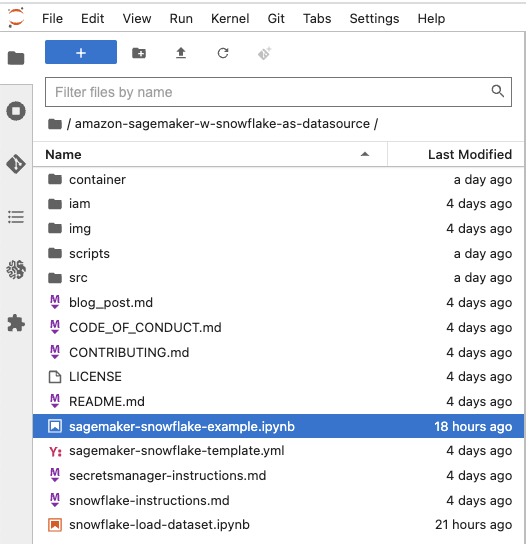

Using Snowflake as a data source to train ML models with Amazon
SageMaker
================

*Amit Arora*, *Divya Muralidharan*, *Sergey Ermolin*

[Amazon SageMaker](https://aws.amazon.com/sagemaker/) is a fully managed
machine learning (ML) service. With SageMaker, data scientists and
developers can quickly and easily build and train ML models, and then
directly deploy them into a production-ready hosted environment. It
provides an integrated Jupyter authoring notebook instance for easy
access to your data sources for exploration and analysis, so you don’t
have to manage servers. It also provides common ML algorithms that are
optimized to run efficiently against extremely large data in a
distributed environment.

Amazon SageMaker requires that the training data for a machine learning
(ML) model be present either in [Amazon Simple Storage Service (Amazon
S3) or in Amazon Elastic File System (Amazon EFS) or in Amazon FSx for
Lustre](https://docs.aws.amazon.com/sagemaker/latest/dg/model-access-training-data.html).
In order to train a model using data stored outside of the three
supported storage services, the data first needs to be ingested into one
of these services (typically Amazon S3). This requires building a data
pipeline (using tools such as [Amazon SageMaker Data
Wrangler](https://aws.amazon.com/sagemaker/data-wrangler/)) to move data
into Amazon S3. However, this approach may create a data management
challenge in terms of managing the lifecycle of this data storage
medium, crafting access controls, data auditing etc., all for the
purpose of staging training data for the duration of the training job.
In such situations it may be desirable to have the data accessible to
SageMaker in the ephemeral storage media attached to the ephemeral
training instances *without* the intermediate storage of data in Amazon
S3.

This post shows a way to do this using the [Snowflake Data
Cloud](https://www.snowflake.com/) as the data source and by downloading
the data directly from Snowflake into a SageMaker Training Job
instance(s).

## Solution overview

We use the [California Housing
Dataset](https://inria.github.io/scikit-learn-mooc/python_scripts/datasets_california_housing.html)
as a training dataset for this post and train an ML model to predict the
median house value for each district. We add this data to Snowflake as a
new table. We create a custom training container which downloads data
directly from the Snowflake table into the training instance ***rather
than first downloading the data into an Amazon S3 bucket***. Once the
data is downloaded into the training instance, the custom training
script performs data preparation tasks and then trains the machine
learning model using the [XGBoost
Estimator](https://sagemaker.readthedocs.io/en/stable/frameworks/xgboost/using_xgboost.html).
All code for this blog post is available in this [GitHub
repo](https://github.com/aws-samples/amazon-sagemaker-w-snowflake-as-datasource).

The following figure represents the high-level architecture of the
proposed solution to use Snowflake as a data source to train ML models
with Amazon SageMaker.

<figure>

<figcaption aria-hidden="true">Figure 1: Architecture</figcaption>
</figure>

## Walkthrough

The workflow for the above architecture is as follows. The detailed
instructions for each step are provided later in this post.

1.  Ingest the data in a table in your Snowflake account.

2.  Store your Snowflake account credentials in AWS Secrets Manager.

3.  Setup an IAM role with appropriate permissions to allow Amazon
    SageMaker to access Amazon ECR, AWS Secrets Manager and other
    services within your AWS account.

4.  Create a custom container image for ML model training and push it to
    Amazon ECR.

5.  Launch a SageMaker Training job for training the ML model. The
    training instance retrieves Snowflake credentials from AWS Secrets
    Manager and then uses these credentials to download the dataset from
    Snowflake directly. *This is the step that eliminates the need for
    data to be first downloaded into an S3 bucket*.

6.  The trained ML model is stored in an Amazon S3 bucket.

### Prerequisites

To implement the solution provided in this post, you should have an [AWS
account](https://signin.aws.amazon.com/signin?redirect_uri=https%3A%2F%2Fportal.aws.amazon.com%2Fbilling%2Fsignup%2Fresume&client_id=signup),
a [Snowflake
account](https://signup.snowflake.com/?utm_cta=trial-en-www-homepage-top-right-nav-ss-evg&_ga=2.36125795.2140702267.1672969035-1338836953.1670007010)
and familiarity with Amazon SageMaker.

### Deployment steps

The following section provide a detailed description of the steps listed
in the walkthrough section.

#### Set up IAM role and SageMaker Notebook

Click ‘Launch Stack’ for the AWS region you want to deploy resources
into. This cloud formation template will create an IAM role called
`SageMakerSnowFlakeExample` and a SageMaker Notebook called
`aws-aiml-blogpost-sagemaker-snowflake-example` in your AWS account.

|        AWS Region         |                                                                                                                                                   Link                                                                                                                                                   |
|:-------------------------:|:--------------------------------------------------------------------------------------------------------------------------------------------------------------------------------------------------------------------------------------------------------------------------------------------------------:|
|  us-east-1 (N. Virginia)  |   [](https://console.aws.amazon.com/cloudformation/home?region=us-east-1#/stacks/new?stackName=sagemake-snowflake-example-stack&templateURL=https://aws-blogs-artifacts-public.s3.amazonaws.com/artifacts/ML-12893/sagemaker-snowflake-template.yml)    |
|     us-east-2 (Ohio)      |   [](https://console.aws.amazon.com/cloudformation/home?region=us-east-2#/stacks/new?stackName=sagemake-snowflake-example-stack&templateURL=https://aws-blogs-artifacts-public.s3.amazonaws.com/artifacts/ML-12893/sagemaker-snowflake-template.yml)    |
| us-west-1 (N. California) |   [](https://console.aws.amazon.com/cloudformation/home?region=us-west-1#/stacks/new?stackName=sagemake-snowflake-example-stack&templateURL=https://aws-blogs-artifacts-public.s3.amazonaws.com/artifacts/ML-12893/sagemaker-snowflake-template.yml)    |
|    us-west-2 (Oregon)     |   [](https://console.aws.amazon.com/cloudformation/home?region=us-west-2#/stacks/new?stackName=sagemake-snowflake-example-stack&templateURL=https://aws-blogs-artifacts-public.s3.amazonaws.com/artifacts/ML-12893/sagemaker-snowflake-template.yml)    |
|    eu-west-1 (Dublin)     |   [](https://console.aws.amazon.com/cloudformation/home?region=eu-west-1#/stacks/new?stackName=sagemake-snowflake-example-stack&templateURL=https://aws-blogs-artifacts-public.s3.amazonaws.com/artifacts/ML-12893/sagemaker-snowflake-template.yml)    |
|  ap-northeast-1 (Tokyo)   | [](https://console.aws.amazon.com/cloudformation/home?region=ap-northeast-1#/stacks/new?stackName=sagemake-snowflake-example-stack&templateURL=https://aws-blogs-artifacts-public.s3.amazonaws.com/artifacts/ML-12893/sagemaker-snowflake-template.yml) |

#### Store Snowflake credentials in AWS Secrets Manager

Store your Snowflake credentials as a secret in AWS Secrets Manager. For
instructions on how to create a secret in AWS Secrets Manager refer to
[`Create an AWS Secrets Manager secret`](https://docs.aws.amazon.com/secretsmanager/latest/userguide/create_secret.html).

1.  Name the secret as `snowflake_credentials`, this is required as the
    code in the `snowflake-load-dataset.ipynb` expects the secret to be
    called that.

2.  Create the secret as a key-value pair with two keys:

    - `username`: this is your Snowflake username
    - `password`: this is the password associated with your Snowflake
      username.

#### Ingest the data in a table in your Snowflake account

1.  In your AWS console navigate to Amazon SageMaker -\> Notebooks
    instances and then click on `Open JupyterLab` for
    `aws-aiml-blogpost-sagemaker-snowflake-example`.

    <figure>
    
    <figcaption aria-hidden="true">Figure 2: Open JupyterLab</figcaption>
    </figure>

2.  Double click on `snowflake-load-dataset.ipynb` to open it in
    JupyterLab. This will ingest the [California Housing
    Dataset](https://inria.github.io/scikit-learn-mooc/python_scripts/datasets_california_housing.html)
    to a Snowflake table.

3.  In the notebook, edit the contents of the following cell to replace
    the placeholder values with the one matching your snowflake account.

    ``` python
    sf_account_id = "your-snowflake-account-id"
    ```

4.  Now click on `Run All Cells` to run the code in this notebook, this
    will download the dataset locally into the notebook and then ingest
    it into the Snowflake table.

    <figure>
    
    <figcaption aria-hidden="true">Figure 3: Notebook Run All
    Cells</figcaption>
    </figure>

    The following code snippet in the notebook ingests the dataset into
    Snowflake. See the `snowflake-load-dataset.ipynb` notebook for the
    full code.

    ``` python
    # connect to Snowflake Table schema
    conn.cursor().execute(f"CREATE SCHEMA IF NOT EXISTS {schema}")
    conn.cursor().execute(f"USE SCHEMA {schema}")

    create_table_sql = f"CREATE TABLE IF NOT EXISTS {db}.{schema}.{table}\n ("

    california_housing.rename(columns=str.upper, inplace=True)
    # iterating through the columns
    for col in california_housing.columns:
        column_name = col.upper()

    if (california_housing[col].dtype.name == "int" or california_housing[col].dtype.name == "int64"):
        create_table_sql = create_table_sql + column_name + " int"
    elif california_housing[col].dtype.name == "object":
        create_table_sql = create_table_sql + column_name + " varchar(16777216)"
    elif california_housing[col].dtype.name == "datetime64[ns]":
        create_table_sql = create_table_sql + column_name + " datetime"
    elif california_housing[col].dtype.name == "float64":
        create_table_sql = create_table_sql + column_name + " float8"
    elif california_housing[col].dtype.name == "bool":
        create_table_sql = create_table_sql + column_name + " boolean"
    else:
        create_table_sql = create_table_sql + column_name + " varchar(16777216)"

    # Deciding next steps. Either column is not the last column (add comma) else end create_tbl_statement
    if california_housing[col].name != california_housing.columns[-1]:
        create_table_sql = create_table_sql + ",\n"
    else:
        create_table_sql = create_table_sql + ")"

    # execute the SQL statement to create the table
    print(f"create_table_sql={create_table_sql}")
    conn.cursor().execute(create_table_sql)  
    print(f"snowflake_table={snowflake_table}")
    conn.cursor().execute('TRUNCATE TABLE IF EXISTS ' + snowflake_table)
    ```

5.  Close the notebook once all cells run without any error. Your data
    is now available in Snowflake. The following screenshot shows the
    `california_housing` table created in Snowflake.

    <figure>
    
    <figcaption aria-hidden="true">Figure 4: Snowflake Table</figcaption>
    </figure>

#### Open sagemaker-snowflake-example.ipynb notebook

<figure>

<figcaption aria-hidden="true">Figure 5: Open SageMaker Snowflake
Notebook</figcaption>
</figure>

This notebook will create a custom training container with SnowFlake
connection, extract data from SnowFlake into the training instance’s
ephemeral storage without staging it in Amazon S3, and perform
Distributed Data Parallel (DDP) XGBoost model training on the data. DDP
Training is not required for model training on such a small dataset; it
is included here for illustration of yet another recently released
SageMaker feature.

#### Creating a custom container for training as part of a Jupyter Notebook

We will now create a custom container for the machine learning model
training job. Note that root access is required for creating docker
container. This SageMaker notebook was deployed with root access
enabled. If your enterprise org policies do not allow root access to
cloud resources, you may want to use this docker file and shell scripts
below to build docker container elsewhere (eg. your laptop) and then
push it into AWS Elastic Container Registry. We will use the container
based on the SageMaker XGBoost container image -
`246618743249.dkr.ecr.us-west-2.amazonaws.com/sagemaker-xgboost:1.5-1`
and has the following additions:

- The [Snowflake Connector for
  Python](https://docs.snowflake.com/en/user-guide/python-connector.html)
  to download the data from the Snowflake table into the training
  instance.

- A Python script to connect to the AWS Secrets Manager to retrieve the
  Snowflake credentials.

Including the Snowflake connector and the Python script for AWS Secrets
Manager ensures that users who use this container image for machine
learning model training do not have to write this code as part of their
training script and can use this functionality that is now already
available to them.

Here is the `Dockerfile` for the training container.

``` python
# Build an image that can be used for training in Amazon SageMaker, we use
# the SageMaker XGBoost as the base image as it contains support for distributed
# training.
FROM 246618743249.dkr.ecr.us-west-2.amazonaws.com/sagemaker-xgboost:1.5-1

MAINTAINER Amazon AI <sage-learner@amazon.com>


RUN apt-get -y update && apt-get install -y --no-install-recommends \
         wget \
         python3-pip \
         python3-setuptools \
         nginx \
         ca-certificates \
   && rm -rf /var/lib/apt/lists/*

RUN ln -s /usr/bin/python3 /usr/bin/python
RUN ln -s /usr/bin/pip3 /usr/bin/pip

# Here we get snowflake-connector python package.
# pip leaves the install caches populated which uses a 
# significant amount of space. These optimizations save a fair 
# amount of space in the image, which reduces start up time.
RUN pip --no-cache-dir install snowflake-connector-python==2.8.3  

# Include python script for retrieving Snowflake credentials 
# from AWS SecretsManager
ADD snowflake_credentials.py /
```

The container image is built and pushed to Amazon ECR. This image is
used for training the machine learning model.

#### Train the machine learning model using Amazon SageMaker Training Job

Once we successfully create the container image and publish it to Amazon
ECR we can now start using for model training.

1.  We create a set of Python scripts to download the data from
    Snowflake using the [Snowflake Connector for
    Python](https://docs.snowflake.com/en/user-guide/python-connector.html),
    prepare the data and then use the `XGBoost Regressor` to train the
    machine learning model. *It is the step of downloading the data
    directly into the training instance that avoids having to use Amazon
    S3 as the intermediate storage for training data*.

    - We facilitate *Distributed Data Parallel* training by having the
      training code download a random subset of the data such that each
      training instance downloads an equal amount of data from
      Snowflake. For example, if there are two training nodes then each
      node downloads a random sample of 50% of the rows in the Snowflake
      table.

      ``` python
      """
      Read the HOUSING table (this is the california housing dataset  used by this example)
      """
      import pandas as pd
      import snowflake.connector

      def data_pull(ctx: snowflake.connector.SnowflakeConnection, table: str, hosts: int) -> pd.DataFrame:

          # Query Snowflake HOUSING table for number of table records
          sql_cnt = f"select count(*) from {table};"
          df_cnt = pd.read_sql(sql_cnt, ctx)

          # Retrieve the total number of table records from dataframe
          for index, row in df_cnt.iterrows():
              num_of_records = row.astype(int)
              list_num_of_rec = num_of_records.tolist()
          tot_num_records = list_num_of_rec[0]

          record_percent = str(round(100/hosts))
          print(f"going to download a random {record_percent}% sample of the data")
          # Query Snowflake HOUSING table
          sql = f"select * from {table} sample ({record_percent});"
          print(f"sql={sql}")

          # Get the dataset into Pandas
          df = pd.read_sql(sql, ctx)
          print(f"read data into a dataframe of shape {df.shape}")
          # Prepare the data for ML
          df.dropna(inplace=True)

          print(f"final shape of dataframe to be used for training {df.shape}")
          return df
      ```

2.  We then provide the the training script to the SageMaker SDK
    [`Estimator`](https://sagemaker.readthedocs.io/en/stable/api/training/estimators.html)
    along with the source directory so that all the scripts we create
    can be provided to the training container when the training job is
    run using the
    [`Estimator.fit`](https://sagemaker.readthedocs.io/en/stable/api/training/estimators.html#sagemaker.estimator.EstimatorBase.fit)
    method. You can find detailed guidance in the documentation on
    [Preparing a Scikit-Learn training
    script](https://sagemaker.readthedocs.io/en/stable/frameworks/sklearn/using_sklearn.html#prepare-a-scikit-learn-training-script)
    (for training).

    ``` python
    custom_img_uri = f"{account_id}.dkr.ecr.{region}.amazonaws.com/{custom_img_name}:{custom_img_tag}"

    # Create Sagemaker Estimator
    xgb_script_mode_estimator = sagemaker.estimator.Estimator(
        image_uri = custom_img_uri,
        role=role,
        instance_count=instance_count,
        instance_type=instance_type,
        output_path="s3://{}/{}/output".format(bucket, prefix),
        sagemaker_session=session,
        entry_point="train.py",
        source_dir="./src",
        hyperparameters=hyperparams,
        environment=env,
        subnets = subnet_ids,
    )

    # start the training job
    xgb_script_mode_estimator.fit()
    ```

3.  Once the model training is completed the trained model is available
    as `model.tar.gz` file in the default SageMaker bucket for the
    region.

    ``` python
    print(f"the trained model is available in Amazon S3 -> {xgb_script_mode_estimator.model_data}")
    ```

4.  **The trained model can now be deployed for getting inference on new
    data!** Detailed instructions are available on the [Create your
    endpoint and deploy your
    model](https://docs.aws.amazon.com/sagemaker/latest/dg/realtime-endpoints-deployment.html)
    page.

## Cleaning up

To avoid incurring future charges, delete the resources. You can do this
by deleting the cloud formation template used to create the IAM role and
the Amazon SageMaker Notebook.

<figure>

<figcaption aria-hidden="true">Figure 6: Cleaning Up</figcaption>
</figure>

You will have to delete the Snowflake resources manually from the
Snowflake console.

## Conclusion

In this solution, we saw how to download data stored in Snowflake table
to Amazon SageMaker Training job instance and train a XGBoost model
using a custom training container. **This approach allows us to directly
integrate Snowflake as a data source with Amazon SageMaker notebook
without having the data staged in Amazon S3.**

We encourage you to learn more by visiting the [Amazon SageMaker Python
SDK](https://sagemaker.readthedocs.io/en/stable/) page and try out
building a solution using the sample implementation provided in this
blog post and a dataset relevant to your business. If you have questions
or suggestions, leave a comment.

------------------------------------------------------------------------

## Author bio

 Amit Arora is an AI and ML
specialist architect at Amazon Web Services, helping enterprise
customers use cloud-based machine learning services to rapidly scale
their innovations. He is also an adjunct lecturer in M.S. data science
and analytics program at Georgetown University in Washington D.C.

<br><br>

 Divya Muralidharan is a
Solutions Architect at Amazon Web Services. She is passionate about
helping enterprise customers solve business problems with technology.
She has a Masters in Computer Science from Rochester Institute of
Technology. Outside of office she spends time cooking, singing and
growing plants.

<br><br>

 Sergey Ermolin is a
Principal AIML Solutions Architect at AWS. Previously, he was a software
solutions architect for deep learning, analytics, and big data
technologies at Intel. A Silicon Valley veteran with a passion for
machine learning and artificial intelligence, Sergey has been interested
in neural networks since pre-GPU days, when he used them to predict
aging behavior of quartz crystals and cesium atomic clocks at
Hewlett-Packard. Sergey holds an MSEE and a CS certificate from Stanford
and BS degree in physics and mechanical engineering from California
State University, Sacramento. Outside of work, Sergey enjoys
wine-making, skiing, biking, sailing and scuba-diving. Sergey is also a
volunteer pilot for Angel Flight (https://www.angelflightwest.org/).
<br><br>
