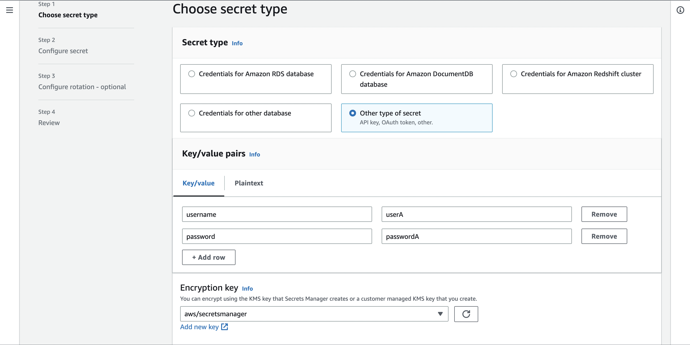
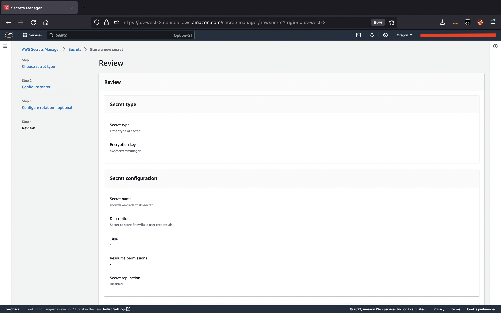

# Secrets Manager Instructions

Here are the steps for storing your Snowflake credentials (password) in AWS Secrets Manager.

**_Please note that you will be using your AWS account to create and store secrets in AWS Secrets Manager. Please refer [How do I create and activate a new AWS account?](https://aws.amazon.com/premiumsupport/knowledge-center/create-and-activate-aws-account/) for AWS account creation and activation instructions._**

## To create a secret from AWS console

1. Open the Secrets Manager console at https://console.aws.amazon.com/secretsmanager/ or type Secrets Manager in the search bar of your AWS console and select AWS Secrets Manager.

1. Choose Store a new secret.

1. On the Choose secret type page, do the following:
    - For Secret type, choose Other type of secret.
    - In Key/value pairs, enter 'username' as Key and value as your Snowflake username. Click the '+ Add Row' to add another entry where 'password' is Key       and your Snowflake password is value. 
    - For Encryption key, choose the AWS KMS key that Secrets Manager uses to encrypt the secret value, and choose Next.

1. On the Configure secret page, enter a descriptive Secret name and Description and keep choosing Next to navigate pages until you land on the Review page. Secret names must contain 1-512 Unicode characters.

1. On the Review page, review your secret details, and then choose Store.

Secrets Manager returns to the list of secrets. If your new secret doesn't appear, choose the refresh button.

