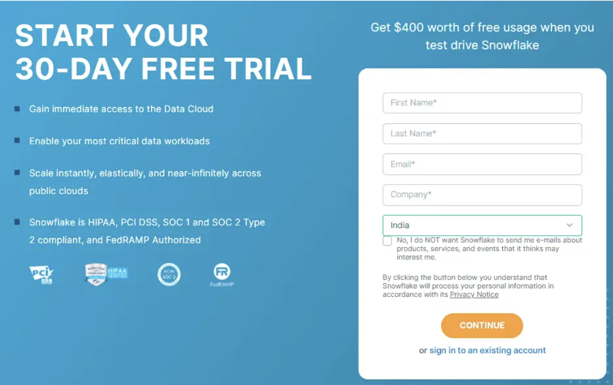
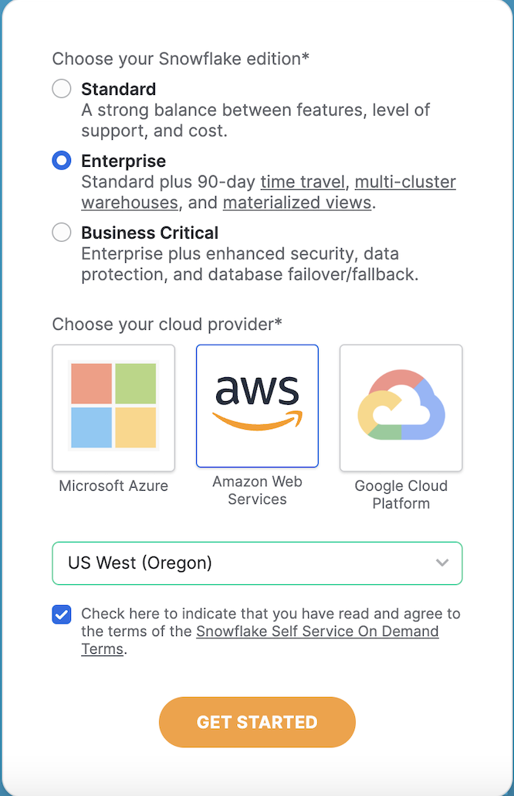
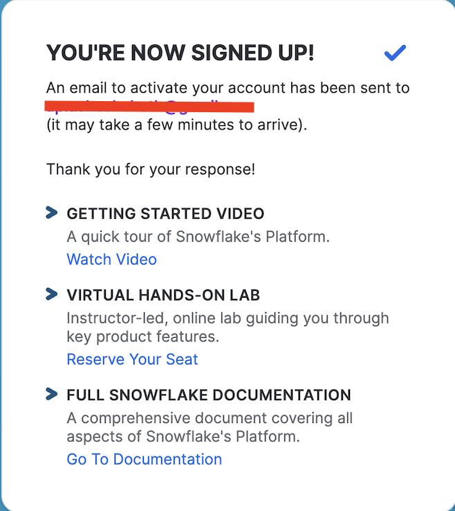
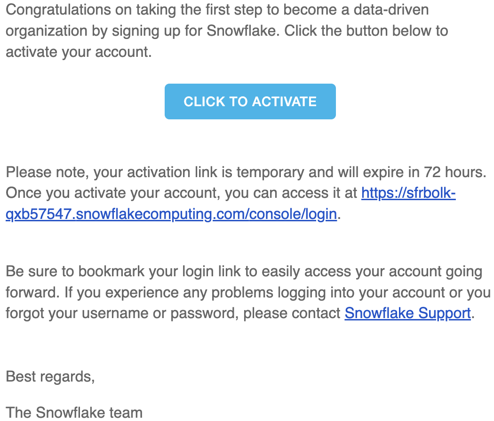
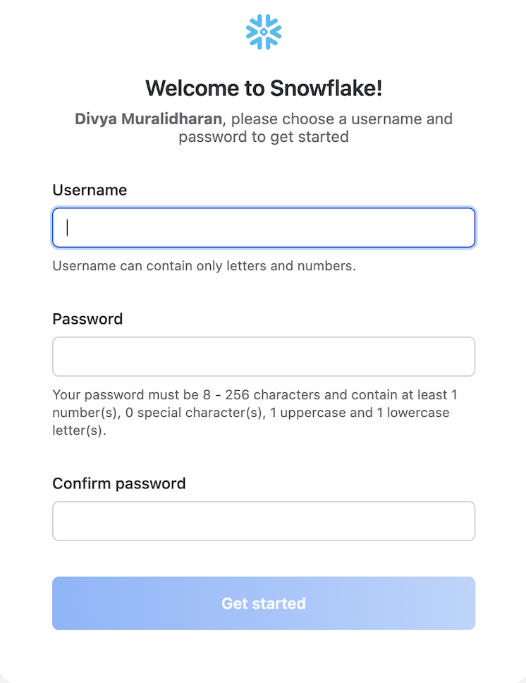
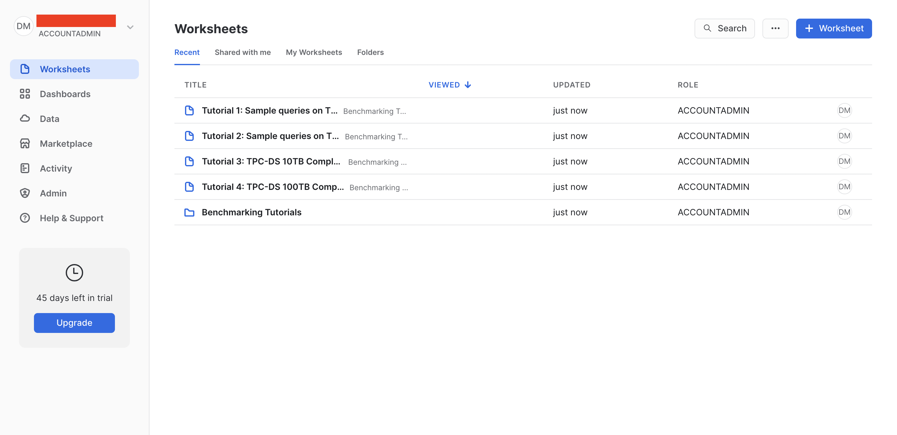
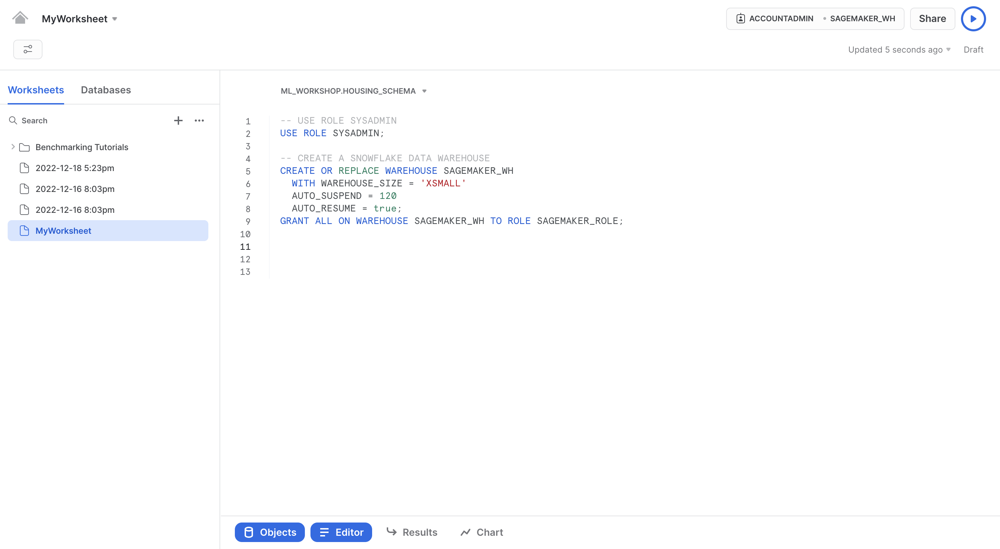

# Instructions for ingesting a dataset into Snowflake

This document describes the steps for ingesting the [California Housing Dataset](https://inria.github.io/scikit-learn-mooc/python_scripts/datasets_california_housing.html) into Snowflake.

## Snowflake Trial Account Creation

1. Navigate to Snowflake Website – https://signup.snowflake.com/.

2. Fill up the self-service form with your first name, last name, email address and company. Select continue.

1. Choose "Enterprise" Snowflake edition, "AWS" as cloud provider and a region for deployment. It is recommended to choose the region close to your physical location for latency. Click on GET STARTED.

1. After completion of previous step, check your email for a message that provides link to activate your new Snowflake account.

1. After activating your account, you will be prompted for creating Username and Password. Enter Username and Password and click on GET STARTED.

1. After creating username and password, you will be prompted to sign in. Sign in using the credentials you created to land on you account's home page.

## Snowflake Table Creation

1. Create a new worksheet by selected the +Worksheet option on the top right corner of your account's home page, and type the commands shown below to create a snowflake data warehouse.

1. After completion of this step, use the `snowflake_load_dataset.ipynb` to create a Snowflake table and load the dataset (stored as a .csv file in Amazon SageMaker Jupyter) into the table, from your Amazon SageMaker console to Snowflake.
